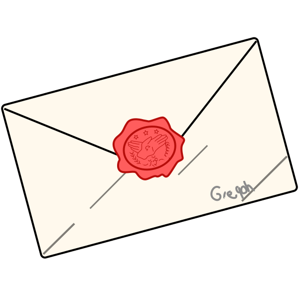

    

<h1 align='center'>Violet Evergarden Wiki</h1>

    
    
    

> 🚧 Desarrollador trabajando ...

**Página web temática dedicada** exlusivamente con contenido sobre la serie anime _Violet Evergarden_. Una Wiki con basta información sobre los eventos y personajes de la serie, explora y sorprendete por detalles que suceden en segundo plano.

Un proyecto Fron-End para aplicar lo aprendido en la materia de programación web II, utilizando únicamente tecnologías _vanilla_ y algunas librerías para agilizar el proceso de desarrollo.

### 🎭 Inspiración

La razón por la que elejí desarrollar una página web por la serie de _Violet Evergarden_ en primer lugar fue por las limitaciones o "condiciones" que debería detener el proyecto (un proyecto Front-End simple), pero más que nada por el fanatismo que tengo sobre la serie y sus historias bastante conmovedoras.

Una Wiki de una serie no es novedad, ya que existen várias plataformas que coleccionan información sobre series animadas como [Fandom.com](https://www.fandom.com/) o incluso la propia [Wikipedia](https://es.wikipedia.org/), pero todas ellas **difunden información de manera plana**, a comparación de páginas completamente dedicadas a una franquicia como el de [Bluey](https://espanol.bluey.tv/ver/).

## 🎯 Contenido

El contenido formal de la página web se divide en varias páginas para explorar lo siguiente:

- [👤 Personajes](): Una colección de todos los personajes que aparecen en la serie, información relevante sobre sus acciones y roles que cumplen en la serie.
- [📼 Capítulos](): Una colección de todos los capítulos de la serie, cada uno con un vídeo, resumen y reseña sobre el mismo.
- [🪄 Especiales](): Una colección de OVAs y películas que tiene la serie, similar a los [capitulos]() en su formato de información.
- [📙 Historia](): Una colección que agrupa los sucesos que pasan en la serie desde un punto de vista periodístico.'

## 🚀 Desarrollo

En el carpeta `./concepts` se encuentra toda la documentación del proceso que se realizo para desarrollar el proyecto, desde la parte de diseño, maquetación e implementación.

1. [Conceptualización](./docs/1_Conceptalizacion.md)
2. [Entorno de trabajo](./docs/2_Entorno_de_trabajo.md)
3. [Despliegue](./docs/3_Despliegue.md)

### 🧰 Herramientas

El proyecto más aparte de tener las cosas implementadas desde cero, utiliza algunas librerías para agilizar el proceso de desarrollo.

- [Bootstrap](https://getbootstrap.com/): Libreria Front-End que ofrece componentes para la creación de páginas web de forma rápida.
- [AnimeJS](https://animejs.com/): Librería de JavaScript para crear animaciones de manera rápida y sencilla.
- [SanitizeCSS](https://github.com/csstools/sanitize.css): Hoja de estilos que resetea los estilos del navegador, así como arreglar errores comunes que sufren estos.
