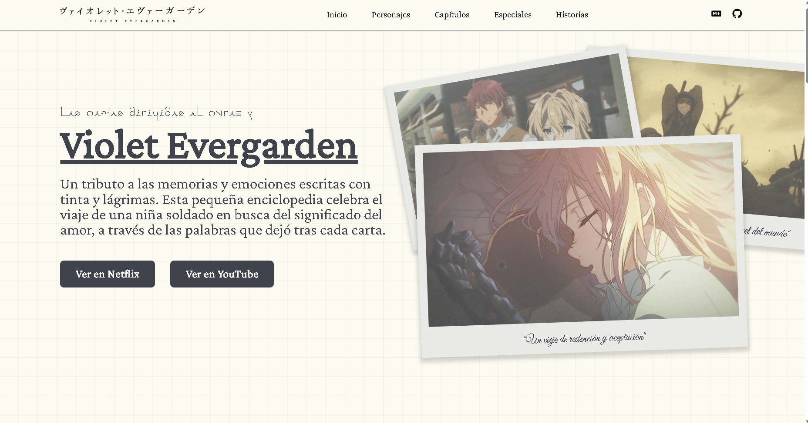

<p align='center'>
    
</p>
<h1 align='center'>Violet Evergarden Wiki</h1>
<p align='center'>
    <a href='https://www.notion.so/Violet-Evergarden-Wiki-129fa5acd16a80c89414f9d433e30ee0?pvs=4'>
        
    </a>
    <a href='https://repollodev.github.io/Violet-Evergarden-Wiki'>
        
    </a>
</p>

<p align='center'>
    
</p>

> 🚧 Desarrollador trabajando ...

**Página web temática temática** de la serie anime _Violet Evergarden_. Basta información sobre los eventos y personajes de la serie, explora y sorpréndete por detalles que suceden en segundo plano.

> [!IMPORTANT]
> Este proyecto es parte del curso de Programación web 2 utilizando únicamente **tecnologías vanilla**, todo para tener a _flex_ y _grid_ en acción.

## 🎭 Inspiración

Una Wiki de una serie no es novedad, ya que existen páginas como [Fandom.com](https://www.fandom.com/) o incluso la propia [Wikipedia](https://es.wikipedia.org/) que almacenan información series. Pero siempre lo hacen de forma muy plana y aburrida.

<table>
    <tr>
        
    </tr>
    <tr>
        <td>
            
        </td>
        <td>
            
        </td>
    </tr>
<table>

Las páginas webs que explotan una temática para aplicarla
en su deseño me parece muy genial, desde páginas oficiales
o conceptos.

Tener algo especializado en vez de solo un
_layout_ de una plataforma con puro texto plano me
parece un gran trabajo para los diseñadores y los
programadores que hicieron eso posible.

## 🌐 Páginas y contenido

El proyecto tiene varias páginas que contienen información sobre la serie, cada una con un propósito diferente y contenido único.

- [🏠 Landing](): Página de inicio para mostrar las diferentes secciones del proyecto.
- [👤 Personajes](): Una colección de todos los personajes que aparecen en la serie, información relevante sobre sus acciones y roles que cumplen en la serie.
- [📼 Capítulos](): Una colección de todos los capítulos de la serie, cada uno con un vídeo, resumen y reseña sobre el mismo.
- [🪄 Especiales](): Una colección de OVAs y películas que tiene la serie, similar a los capítulos en su formato de información.
- [📙 Historia](): Una colección que agrupa los sucesos que pasan en la serie desde un punto de vista periodístico.

## 🧰 Documentación

La Documentación se encuentra publicada en [Notion](https://www.notion.so),
la misma describe el proceso de desarrollo del
proyecto desde la propia concepción hasta
el despliegue para que puede ser visto en internet.

1. [🥸 Recopilando información](https://dorian-pike-610.notion.site/1-Recopilando-informaci-n-0da29f9724df444fa2d260d50ccbf43f)
2. [📊 Estructura del proyecto](https://dorian-pike-610.notion.site/2-Estructura-del-proyecto-c1edcf7502cd4fe3ae456cad5ff310bb)
3. [🖋️ Conceptualización](https://dorian-pike-610.notion.site/129fa5acd16a809ab23fe97b72aaa819?v=690607fa82bd44749dc823f498274cdc)
4. [🎨 La paleta perfecta](https://dorian-pike-610.notion.site/4-La-paleta-perfecta-129fa5acd16a80b49798f797d526945d)
5. [😤 Inspiración](https://dorian-pike-610.notion.site/5-Inspiraci-n-129fa5acd16a80378a88c4ccffa8a09a)
6. [📦 Recursos](https://dorian-pike-610.notion.site/6-Recursos-129fa5acd16a80f69952f2dcfb96b7b1)
7. [🐧 Diseñando](https://dorian-pike-610.notion.site/7-Dise-ando-129fa5acd16a8041acc7fc540e58d889)
8. [🪟 Layout](https://dorian-pike-610.notion.site/8-Layout-129fa5acd16a806eb351f2c71f361e54)
9. [💻 Programando páginas](https://dorian-pike-610.notion.site/9-Programando-p-ginas-129fa5acd16a805ea27acf987eb5d31b)
10. [🚀 Despliegue](https://dorian-pike-610.notion.site/10-Despliegue-129fa5acd16a803bb797e97f56f9153c)

## 🚀 Correr el proyecto

Para correr el proyecto en tu máquina local, sigue los siguientes pasos:

1. Clona el repositorio en tu máquina local.

```bash
git clone
```

2. Abre el proyecto en Visual Studio Code

```bash
cd violet-evergarden-wiki
code .
```

3. Instala la extensión de [Live Server](https://marketplace.visualstudio.com/items?itemName=ritwickdey.LiveServer) o [Live Server Preview](https://marketplace.visualstudio.com/items?itemName=ms-vscode.live-server) en Visual Studio Code.

4. Abre el archivo `index.html` y da click en el botón `Go Live` en la esquina inferior derecha de Visual Studio Code.

5. ¡Listo! El proyecto se abrirá en tu navegador predeterminado.
