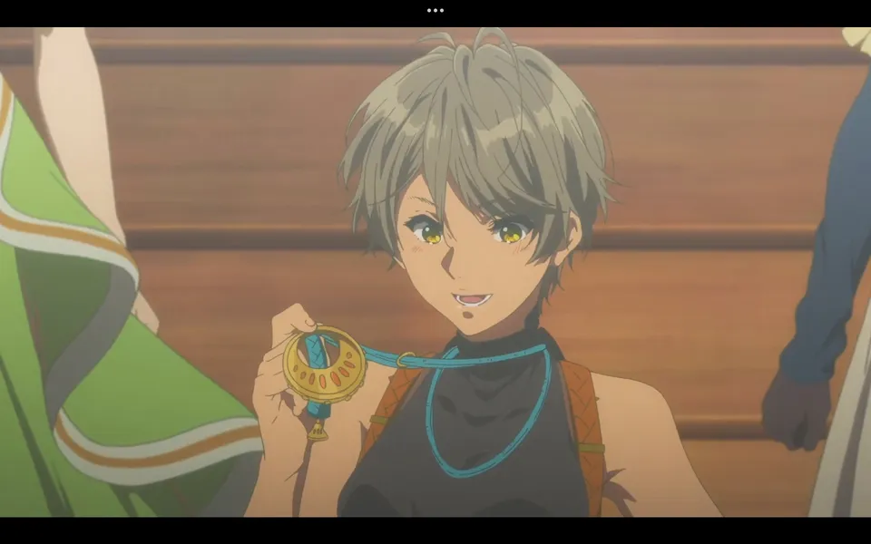
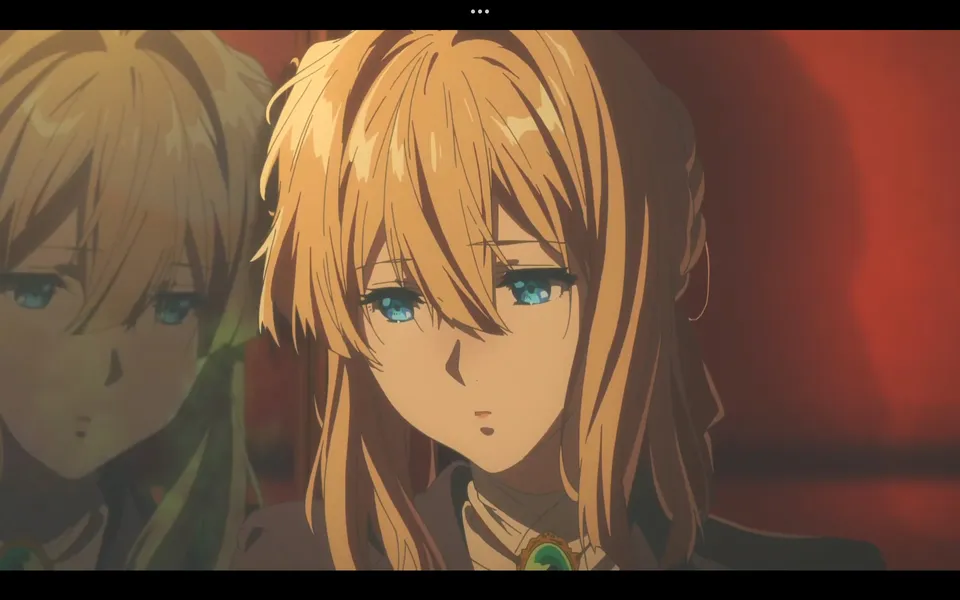
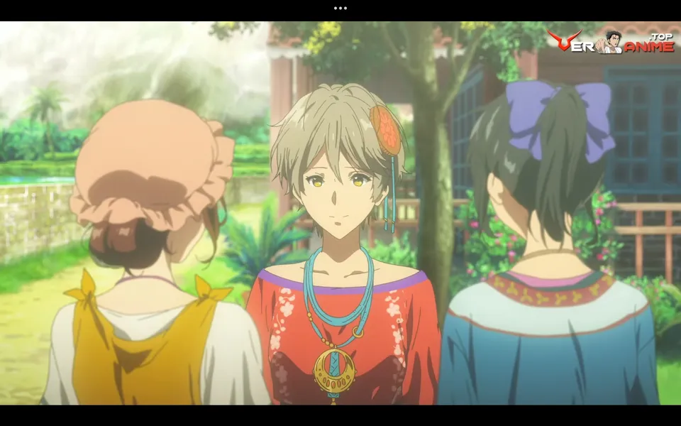
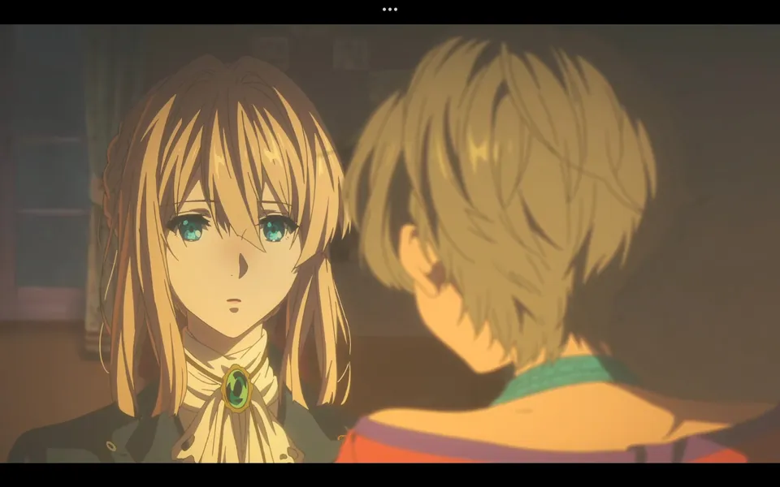
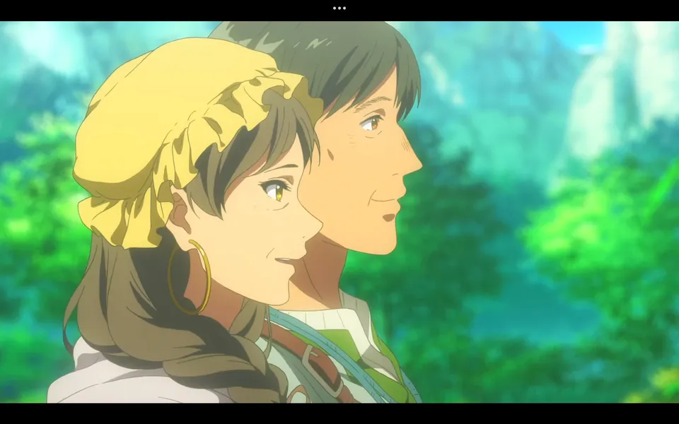
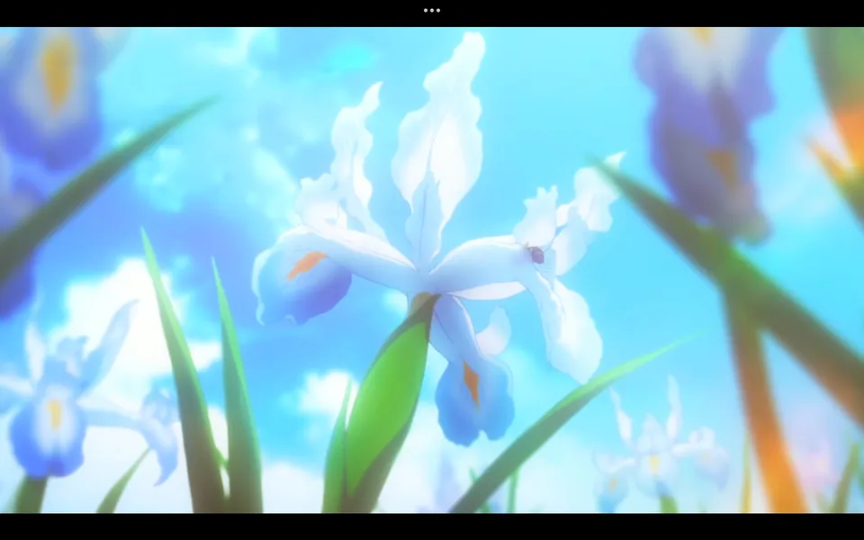
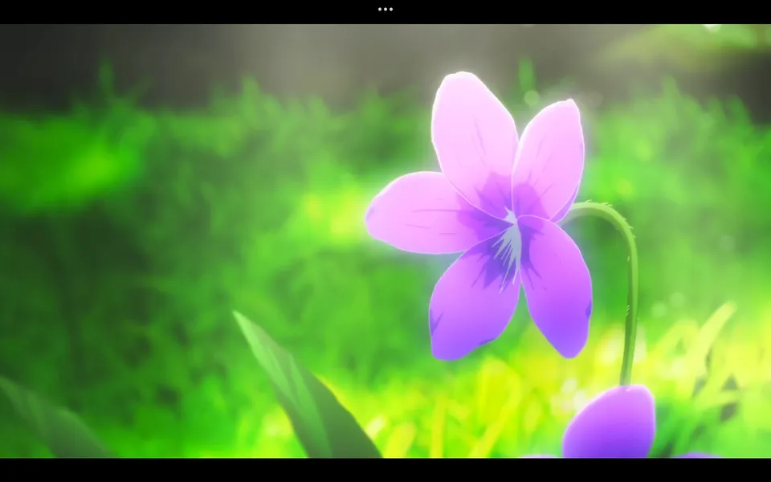

<h1 align='center'>No serás una herramienta, sino una persona digna de ese nombre</h1>

    

Por una solicitud de trabajo, Iris es reservada para escribir
cartas en el pueblo de Kazaly, lugar donde nació y creció antes
de convertirse en una Auto Memories Doll. Por esta noticia,
las chicas de la oficina deciden comer juntas, pero
al salir y en una comversación Iris tropieza lastimándose
el brazo.

Tras el accidente, Violet acompaña a Iris a Kazaly para
escribir cartas junto a ella. Viajando en tren, Iris le
cuenta a Violet un poco sobre el lugar y su familia,
sintiendo gran curiosidad por la vida de Violet.

Al llegar a Kazaly, Iris y Violet se encuentran con la
familia de Iris, quienes les dan la bienvenida y les
revelan que ellos fueron quienes solicitaron el servicio
para poder festajar el cumpleaños de Iris.

Iris y Violet van a la casa de la familia de Iris, donde
ven los preparativos para la fiesta, más importante aún,
la lista de invitados. Iris se siente incómoda al ver
que su familia invitó a más varones, viendo la intensión
de sus padres de casarla con alguien.

Por la tarde ese día, Iris enojada por la situación, le
pide a Violet que no escriba una invitación para
"Eamonn Snow", un hombre que Iris no quiere ver. Pero,
Violet lo hace de todas formas entregando las cartas
por la noche.

Llega el día de la fiesta, donde Iris se siente bastante
incómoda por la lesión en su brazo y constante
insistencia de su madre por conocer a los jóvenes del pueblo.
Llevandose la sorpresa de que Eamonn asistió a la fiesta,
causando un gran disgusto en Iris y provocando que la
fiesta se termine abruptamente.

Tras la fiesta, Violet intenta consolar a Iris, quien
le cuenta que Eamonn es su primer amor, persona que
la rechazó al confesarle sus sentimientos, razón por
la que Iris huyó de Kazaly para convertirse en una
Auto Memories Doll.

Violet le propone a Iris escribir una carta de disculpa
a todos los invitados, incluyendo a sus padres para decirles
lo que realmente siente. Iris acepta y Violet escribe
la carta, la cual es entregada por la mañana siguiente.

Antes de partir, los padres de Iris se disculpan con ella
por la situación y le agradecen a Violet por ayudar a
Iris a expresar sus sentimientos. El padre de Iris se
despide de su hija dandole un ramo de lirios.

Al volver en tren a Leiden, Iris le explica a Violet
que los lirios son razón de su nombre, por que nació
en la epoca en la que estos florecen. Violet, recuerda
a Gilbert y como él le dio un nombre tras ver una
Violeta, diciendole que "serás digna de un nombre y dejaras
de ser una herramienta".

> Un capítulo que nos cuenta un poco más sobre la vida de Iris
> y las relaciones que tiene en su pueblo natal, desarrollandose
> tanto Iris como Violet en la historia. Un bello recuerdo
> de los nombres que llevan ambas chicas y el significado
> que tienen para ellas.

## 📷 Galería

<table>
    <tr>
        <td>
            
        </td>
        <td colspan='2'>
            
        </td>
    </tr>
    <tr>
        <td>
            
        </td>
        <td>
            
        </td>
        <td>
            
        </td>
    </tr>
    <tr>
        <td colspan='2'>
            
        </td>
        <td>
            
        </td>
    </tr>
</table>
