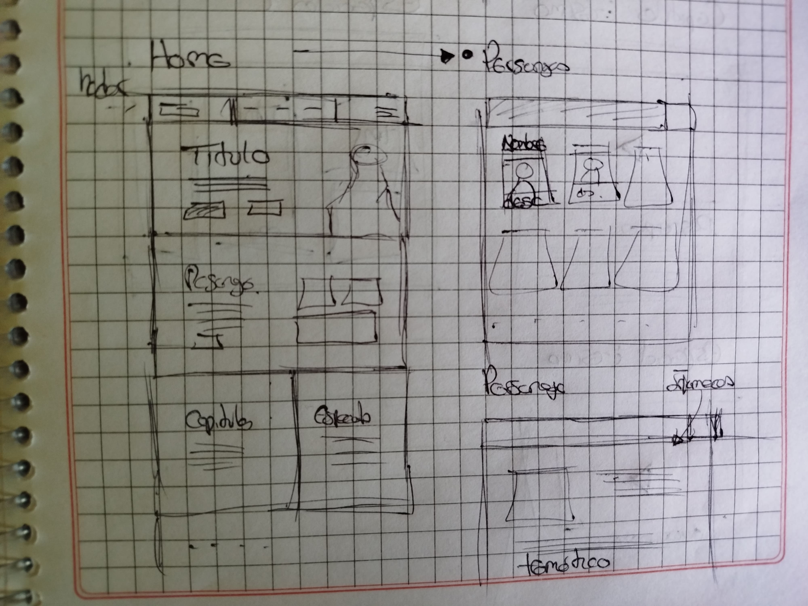
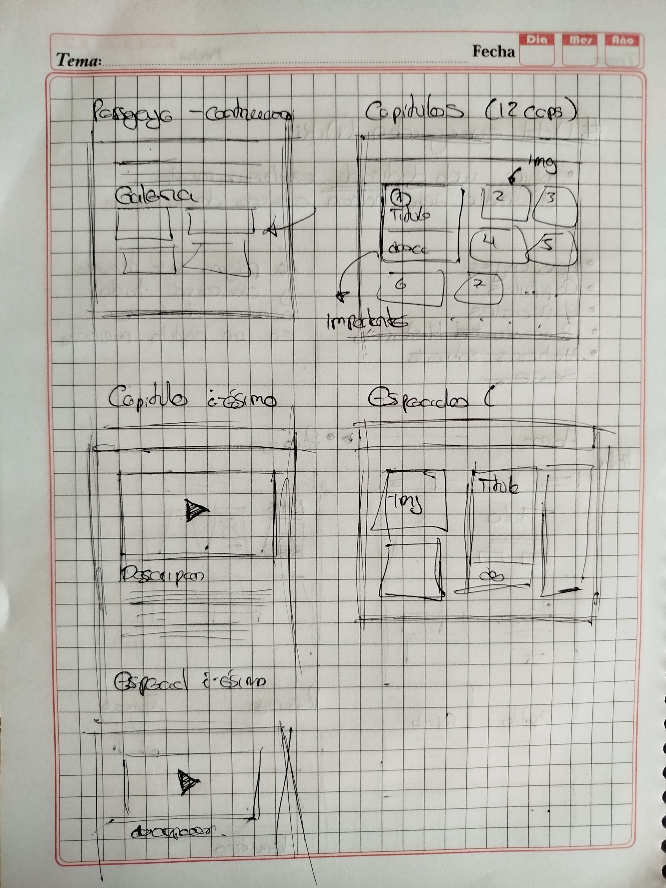
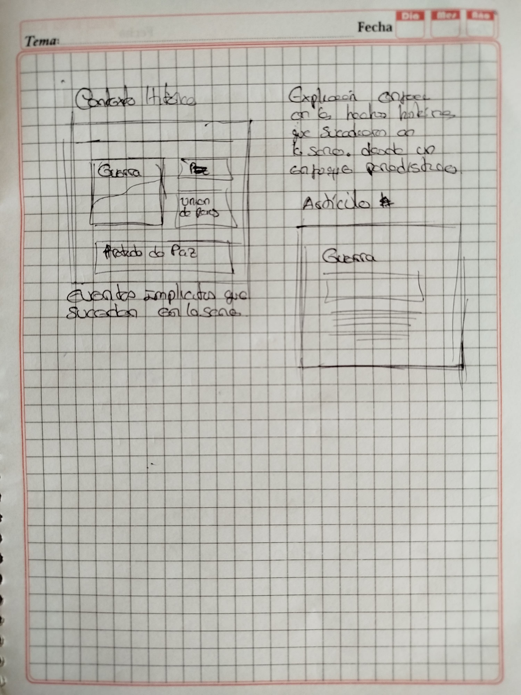
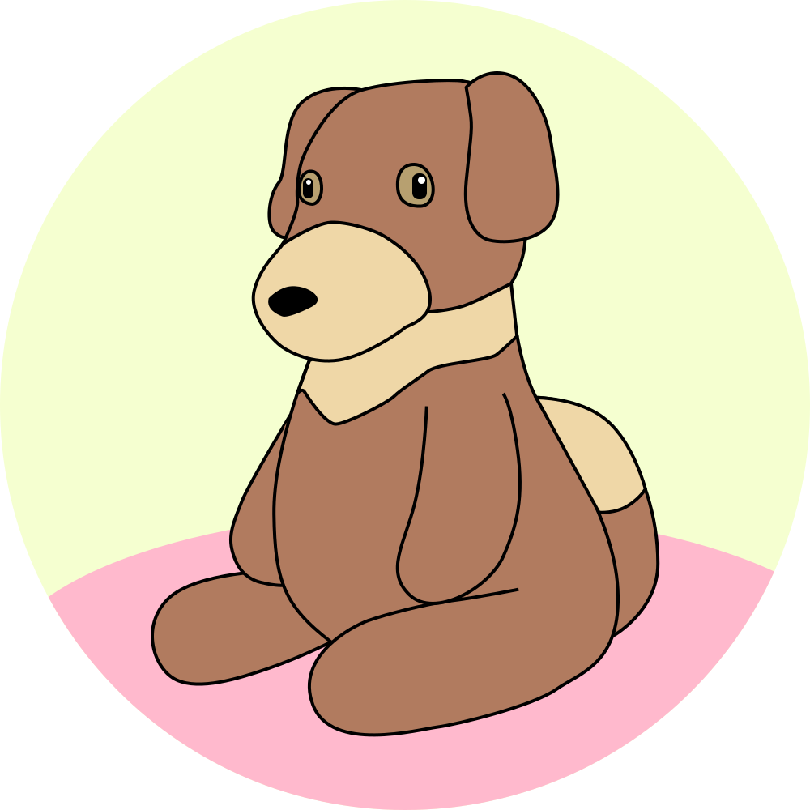

<h1 align='center'>🤔 Conceptualización</h1>

Tras tomar la desición de realizar una Wiki para la serie de _Violet Evergarden_, simplemente tenía que pensar en que cosas debería de contener la página. Fuera del objetivo principal de crear una página web bien diseñada, **la página expone información**, similar a la que hace cualquier otra Wiki, blog o periódico.

En una serie tiene varias cosas que enriquesen lo contado, sus personajes, sus escenarios, los eventos que suceden al transcurrir los episodios, etc. Por lo tanto, tenía claro que exponer en la página.

- **Personajes**: Estudiar a cada personaje que aparece en la serie.
- **Capítulos**: Resumir textualmente los capítulos de la serie.
- **Especiales**: Resumir la OVA y las películas, similar a lo que haría en los capítulos.
- **Historia**: Contar los eventos sucedidos en la serie, la historia princiapal, sucesos secundarios y eventos cronológicos.

Con esto ya tengo lo básico para saber en que tipo de información debo reunir.

## 🎨 Diseño conceptual

Saber más o menos lo que quieres hacer y plasmarlo en un dibujo es la manera más fácil de tener una guía para comenzar, entonces debía visualizar como tendría que verse el resultado final.

    <table>
        <tr>
            
        <tr/>
        <tr>
            <td>
                
            </td>
            <td>
                
            </td>
        </tr>
    </table>

Las páginas que quería que el proyecto tengo eran bastante claras, el diseño puede ser cuestionable y modificable conforme se vaya construyendo, pero sin duda es a lo que quería llegar.

## 🤑 Marca del negocio

Si estamos pensando en como sería el resultado final, por que no por la marca, una imagen representa a un negocio fácilmente. Por lo tanto, quería crear un logo para el proyecto, algo representativo, llegando a crear dos logos que tal vez se puedan usar en el futuro.

    <table>
        <tr>
            <td>
                
            </td>
            <td>
                
            </td>
        </tr>
    </table>

Por un lado el peluche que elige Violet en el primer episodio, y por otro lado el diseño de un sobre con un sello de cera, ambos representativos de la serie. Personalmente prefiero la carta ya que es más conocida por la serie, pero el peluche es más representativo de la protagonista.