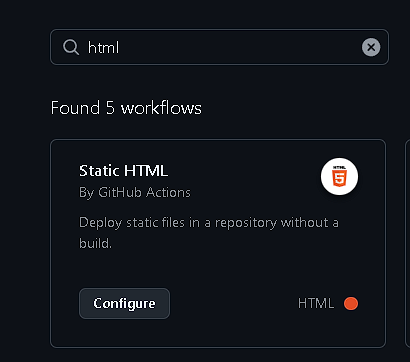

<h1 align='center'>🚀 Despliegue</h1>

Prácticamente un proyecto web debe ser desplegado
para que sea accesbile a los usuarios, de lo contrario
**que sentido tiene mostrar un proyecto web**.

El despliegue de un proyecto completamente _vanilla_
es muy simple, existen varios servicios que permiten
hacerlo de manera gratuita.

## 🎈 GitHub Pages

GitHub Pages es un servicio de GitHub que permite
desplegar proyectos estáticos de manera gratuita.
Este proceso es bastante sencillo y se lo puede
hacer con algunos clicks. Pero, para este caso
se utilizan los _Github Actions_, que son _scripts_
que se ejecutan en GitHub.

La pregunta es, ¿por qué usar _Github Actions_? Pues, por
simple comodidad, ya que **el proyecto puede ser complejo**
durante el desarrollo y puede que necesitemos hacer
ciertas cosas para realizar el despliegue. Entonces, con
_Github Actions_ podemos adelantarnos a esos problemas.

### 📦 Configuración

En el apartado de _Actions_ en el repositorio se puede
crear una action o utilizar una _workflow_ ya existente.
Para este caso, se utiliza el _Static HTML_.

<p align='center'>
    
</p>

De esta manera, ya se tiene una forma de desplegar el
proyecto de manera automática. Cada vez que se haga un
_push_ a la rama _main_, se ejecutará la _workflow_ y
se desplegará el proyecto.

## 🤔 ¿Por qué ahora?

La razón de hacer el despliegue ahora es porque pensaba
en el problema que existiría si dejo este problema
para el final. Pues por la estructura del proyecto
no es tan sencillo hacer el despliegue.

```bash
# Estructura del proyecto
├── assets
├── docs
├── pages
```

Como se puede ver, las páginas están en la carpeta
`pages`, pero para que el despliegue funcione, se
necesita que las páginas estén en la raíz del proyecto.
Comenzando por el `index.html`.

Entonces, buscando un poco dí con una solución que
consiste en hacer una redirección en el `index.html`
a la página principal `pages/index.html`.

```bash
# Estrucutra del proyecto
├── assets
├── docs
├── pages
├── index.html
```