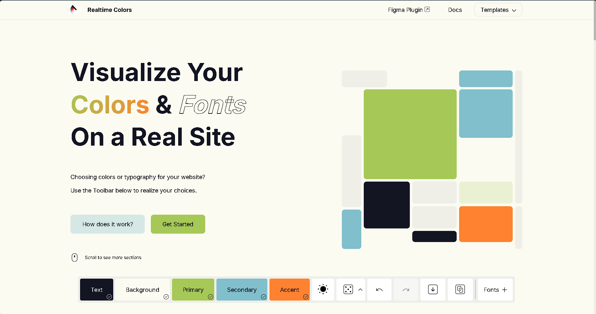
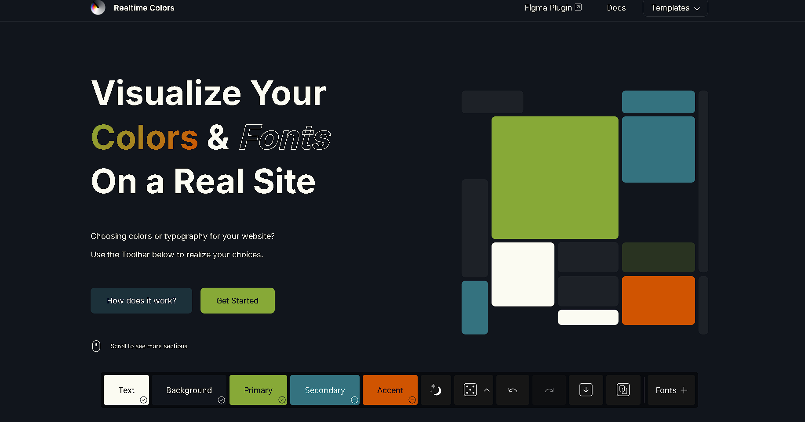

<h1 align='center'>🎨 La paleta perfecta</h1>

No soy diseñador, pero comprendo ciertos aspectos importantes
que se deben tener en cuenta al crear una página web. Entre ellos
es la paleta de colores.

Cuando alguien quiere crear algo visualmente atractivo, los
colores son fundamentales, incluso poseen significados que
generan emociones en las personas. Por otro lado, buscar
inspiración es una tarea que puede llevar tiempo, pero
afortunadamente existen herramientas que nos facilitan la
búsqueda de la paleta perfecta.

## 🧑‍🎨 Buscando inspiración

La serie de _Violet Evergarden_ se caracteriza mucho por su
animación y la paleta de colores que utiliza. Al menos desde
mi punto de vista los colores que maneja la serie son:

- **Elegantes**: probablemente por el estilo de animación
- **Vibrantes**: por mostrar muchos escenarios y situaciones con mucha iluminación
- **Nostálgicos**: por las historias que parecen estar en un pasado lejano

<table>
    <tr>
        <td>
            
        </td>
        <td>
            
        </td>
        <td>
            
        </td>
    </tr>
</table>

> Diseño de página web obtenido de DeviantArt [MrShu20](https://www.deviantart.com/mrshu20/art/Violet-Evergarden-UI-Design-949450197)

<table>
    <tr>
        <td>
            
        </td>
        <td>
            
        </td>
        <td>
            
        </td>
    </tr>
</table>

En general, son colores bastante cálidos y suaves, en su mayoría
muy formales y elegantes, incluso diría que estos colores los
puedo sacar desde el mismisimo Office de Microsoft.

## 😎 El tema

Uilizando como referencia a las anteriores imagenes y haciendo uso
de herramientas como [Coolors](https://coolors.co/), [DaisyUI](https://daisyui.com/) y sobre todo [RealTimeColor](https://www.realtimecolors.com/) damos con la siguiente paleta de colores:

<table>
    <tr>
        <td>
            
            <a href='https://www.realtimecolors.com/?colors=131523-fbfbf2-a6c856-80bfcb-fe822f&fonts=Inter-Inter'>
                <kbd>
                    👆 Click para ver
                </kbd>
            </a>
        </td>
        <td>
            
            <a href='https://www.realtimecolors.com/?colors=fbfbf2-11151c-87a937-34727f-d05401&fonts=Inter-Inter'>
                <kbd>
                    👆 Click para ver
                </kbd>
            </a>
        </td>
    </td>
<table>

Por lo mostrado es más que evidente que la página implementará
un modo oscuro y claro, con colores que se asemejan a los de la
serie _Violet Evergarden_.

> La paleta de colores se puede ver en el archivo `variables.css` en la carpeta [/assets/styles/variables.css](../assets/styles/variables.css)