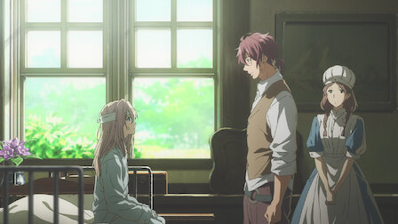

<h1 align='center'>📼 Capítulos</h1>

En esta página se muestran todos los capítulos de la
serie _Violet Evergarden_, comenzando por los
metadatos:

- **Título**: Nombre del capítulo.
- **Número**: Número de capítulo.
- **Fecha de emisión**: Fecha de emisión del capítulo.
- **Miniatura**: Imagen de miniatura del capítulo.

Luego, como contenido principal, se muestran información
relevante del capítulo:

- **Video Trailer**: Un video de YouTube que muestra un
  trailer del capítulo.
- **Resumen**: Un resumen textual del capítulo.
- **Reseña**: Una reseña personal del capítulo.
- **Galería**: Imágenes del capítulo.
- **Curiosidades**: Curiosidades del capítulo.
- **Personajes**: Personajes que aparecen en el capítulo.

# 📁 Contenido

<table>
  <tr>
      <h4>Capítulo 1</h4>
      
      <a href='./chapter_1/README.md'><kbd>Ver 👀</kbd></a>
  </tr>
  <tr>
    <td>
      <h4>Capítulo 2</h4>
      
      <a href='./chapter_2/README.md'><kbd>Ver 👀</kbd></a>
    </td>
    <td>
      <h4>Capítulo 3</h4>
      
      <a href='./chapter_3/README.md'><kbd>Ver 👀</kbd></a>
    </td>
    <td>
      <h4>Capítulo 4</h4>
      
      <a href='./chapter_4/README.md'><kbd>Ver 👀</kbd></a>
    </td>
  </tr>
  <tr>
    <td>
      <h4>Capítulo 5</h4>
      
      <a href='./chapter_5/README.md'><kbd>Ver 👀</kbd></a>
    </td>
    <td>
      <h4>Capítulo 6</h4>
      
      <a href='./chapter_6/README.md'><kbd>Ver 👀</kbd></a>
    </td>
    <td>
      <h4>Capítulo 7</h4>
      
      <a href='./chapter_7/README.md'><kbd>Ver 👀</kbd></a>
    </td>
  </tr>
  <tr>
    <td>
      <h4>Capítulo 8</h4>
      
      <a href='./chapter_8/README.md'><kbd>Ver 👀</kbd></a>
    </td>
    <td>
      <h4>Capítulo 9</h4>
      
      <a href='./chapter_9/README.md'><kbd>Ver 👀</kbd></a>
    </td>
    <td>
      <h4>Capítulo 10</h4>
      
      <a href='./chapter_10/README.md'><kbd>Ver 👀</kbd></a>
    </td>
  </tr>
  <tr>
    <td>
      <h4>Capítulo 11</h4>
      
      <a href='./chapter_11/README.md'><kbd>Ver 👀</kbd></a>
    </td>
    <td>
      <h4>Capítulo 12</h4>
      
      <a href='./chapter_12/README.md'><kbd>Ver 👀</kbd></a>
    </td>
    <td>
      <h4>Capítulo 13</h4>
      
      <a href='./chapter_13/README.md'><kbd>Ver 👀</kbd></a>
    </td>
  </tr>
</table>

## 🥑 Fuentes

- [Lista de episodios (Wikipedia)](https://es.wikipedia.org/wiki/Anexo:Episodios_de_Violet_Evergarden)
- [Lista de episodios (IMDb)](https://www.imdb.com/title/tt7078180/episodes/?ref_=tt_eps_sm)
- [Lista de episodios (Netflix)](https://www.netflix.com/title/80182123)
- [Lista de episodios (Fotogramas)](https://www.fotogramas.es/series-tv-noticias/a43493364/violet-evergarden-anime-orden-peliculas-temporadas-serie/)
