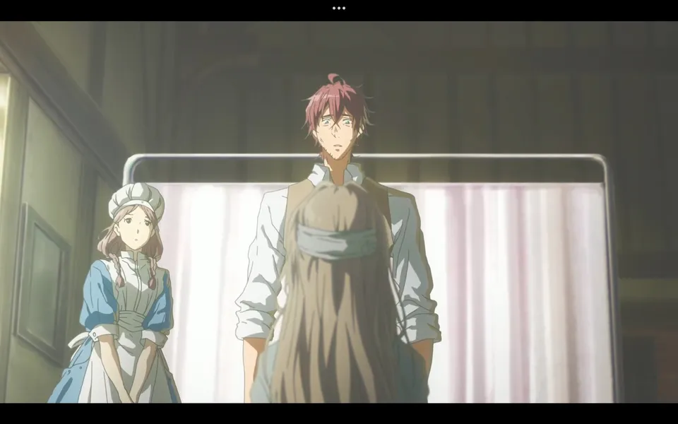
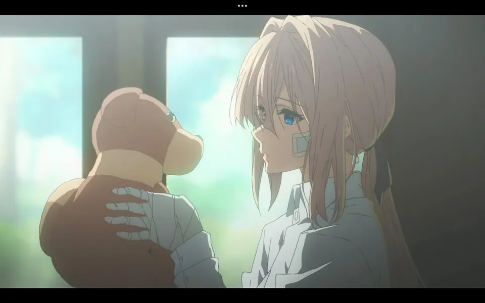
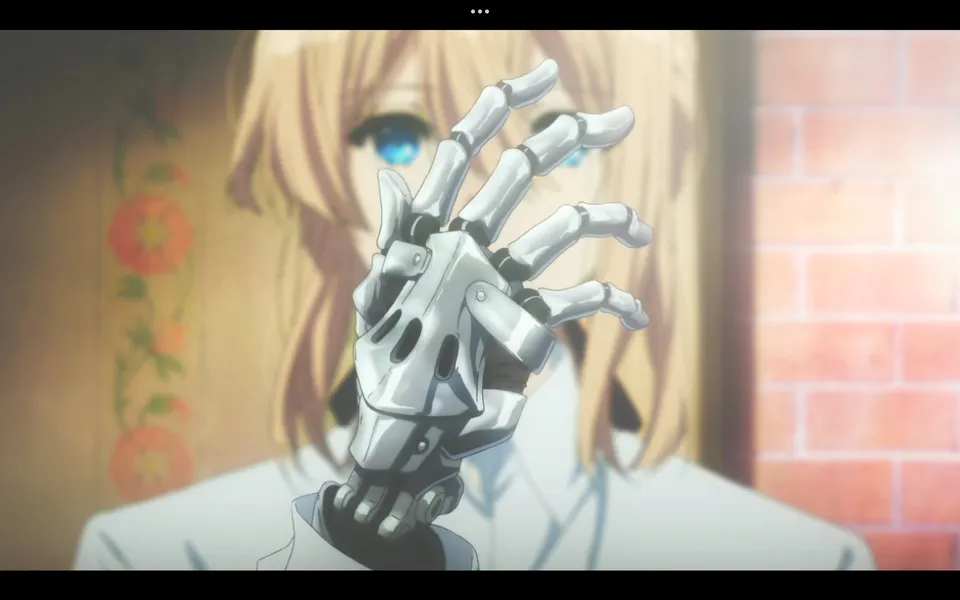
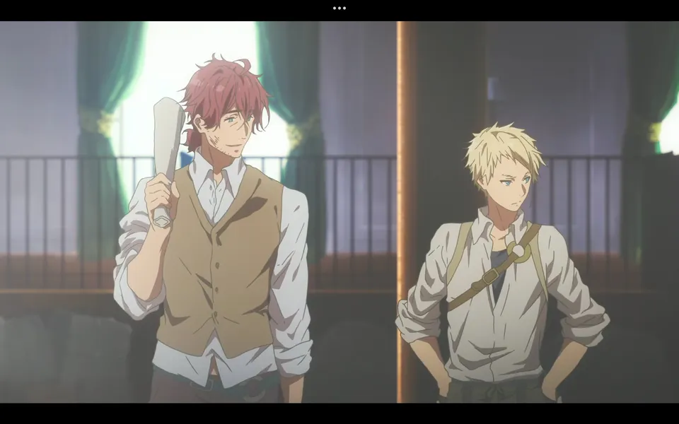
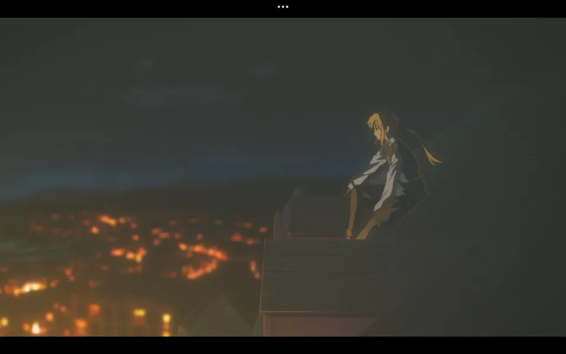
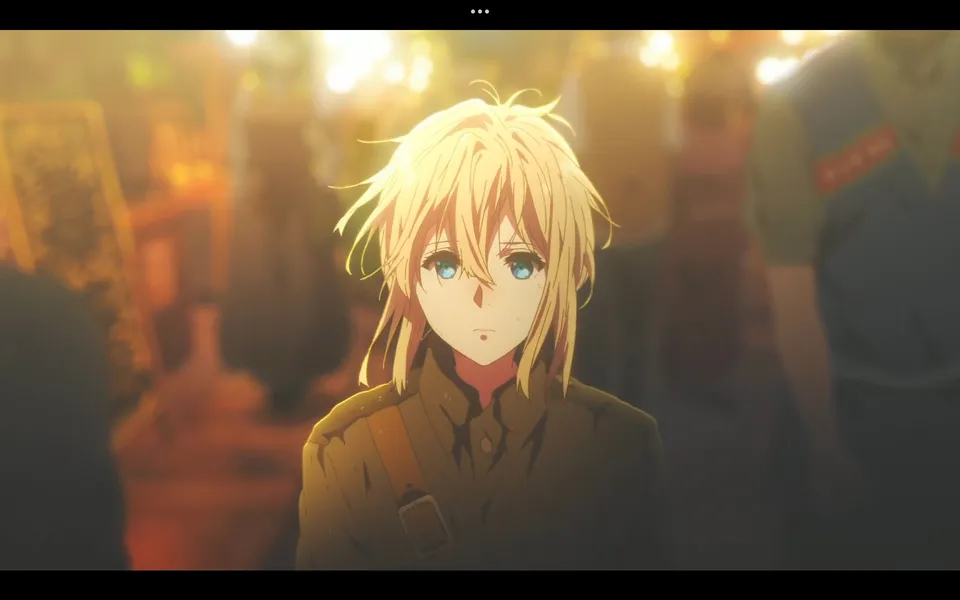

<h1 align='center'>"Te amo" y Auto Memory Dolls</h1>

    

Violet es una soldado del Ejercito de _Leidenschaftlich_ que sirvió en la guerra
bajo el mando del Mayor Gilbert Bougainvillea, una persona bastante importante
para ella.

Después de la guerra, Violet resulta herida en una misión y es hospitalizada,
lamentablemente perdiendo sus dos brazos y siendo reemplazados por prótesis
mecánicas.

El Coronel Hodgins, un viejo amigo de Gilbert, llega a recoger a Violet del
hospital, explicandole que la guerra ha terminado y la paz ha llegado, aunque
dudoso de mencionar el estado de Gilbert.

Ambos se van a la ciudad de _Leiden_, donde Hodgins habia hecho un arreglo
para que Violet fuera adoptada por la familia Evergarden, cercana al mayor. Sin embargo,
Violet no puede adaptarse a ese estilo de vida por su condición de soldado.

Hodgins, al ver que Violet no se adapta a la vida de la familia Evergarden, decide
llevarla a trabajar en su empresa de correos, _CH Postal Company_, donde Violet
en principio ordena y clasifica cartas bajo la supervisión del amigo de Hodgins, Benedict.

Violet pasa a entregar cartas a los clientes, quedandose hasta altas horas de la noche, en
eso Hodgins encuentra a Violet para cenar junto a Benedict y hablar sobre sobre
su situación.

Al día siguiente, mientras violet limipia las ventanas, entra un cliente solicitando
una redacción de una carta de amor. Una de las escritoras de la empresa, Cattleya Baudelaire,
escribe la carta con dulces palabras que llegan al corazón del cliente y Violet.

Violet, al ver la carta, se siente confundida por el significado de las palabras "Te amo",
ya que no entiende el significado de la palabra "amor". Razón por la cual, Violet
comienza a buscar el significado de la palabra "amor" en la ciudad convirtiendose
en una Auto Memory Doll

> Un primer capítulo que nos introduce a la vida de Violet y como es
> desenvolverse en un mundo sin guerra, adaptandose a una vida normal
> y comenzando su viaje de autodescubrimiento sobre el significado de
> la palabra "amor".

## 📷 Galería

<table>
    <tr>
        <td>
            
        </td>
        <td colspan='2'>
            
        </td>
    </tr>
    <tr>
        <td>
            
        </td>
        <td>
            
        </td>
        <td>
            
        </td>
    </tr>
    <tr>
        <td colspan='2'>
            
        </td>
        <td>
            
        </td>
    </tr>
</table>
