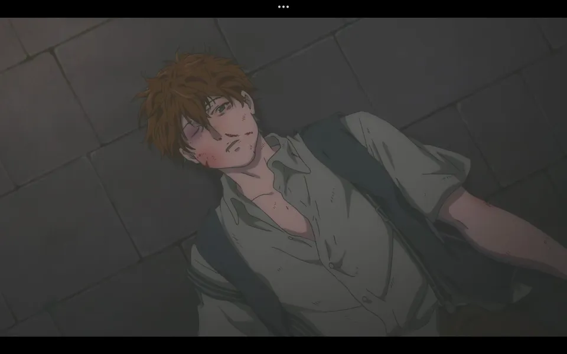

<h1 align='center'>Que seas una ejemplar Auto Memory Doll</h1>

    

Violet Comienza a asistir a la escuela de Auto Memory Dolls, donde
aprenderá a escribir cartas para otras personas, siendo que
el broche de oro de su formación representa un signo de
excelencia en su trabajo.

En su primer día de clases, Violet destaca por su comportamiento
y habilidades técnicas, cosa que se extiende a lo largo del
curso.

Durante su tiempo en la escuela, Violet se hace amiga de
Luculia Marlborough, una chica que también está aprendiendo
a ser una Auto Memory Doll, personaje que se convierte en
un pilar importante en el crecimiento de Violet.

Erá más que evidente la falta de habilidades sociales de
Violet, escribiendo cartas como si de un reporte militar
se tratara, lo que la lleva a ser reprendida por la profesora.
Pero, Luculia le enseña a Violet un lugar hermoso de la ciudad,
para tranquilizarla.

La misma noche, ambas se encuentras con el hermano de Luculia,
Spencer Marlborough, dando la primera impresión de ser un
hombre borracho y violento, cosa que se ve reflejada en
la vida de ambos hermanos en el hogar.

Finaliza el curso y Violet no logra graduarse, quedando
inconforme con su desempeño, Violet vuelve a la escuela
encontrandose con Luculia, quien le ofrece escribir una
carta al Major Gilbert, pero Violet no sabe cómo hacerlo.
Tras eso, Luculia le confieza a Violet que sus padres
murieron en la guerra y que su hermano Spencer se convirtió
en un alcohólico por la culpa de no haber podido protegerlos.
Cosa que Luculia rompe en llanto y escapa del lugar.

Tras conocer mejor la situación de Luculia, Violet decide
escribir una carta para su hermano, Spencer, con el fin
de que se reconcilien y le haga saber sus sentimientos, con
las palabras "Gracias por estar vivo", palabras que
conmovieron a Spencer y replantearsu su vida.

Al final, Violet se gradúa de la escuela de Auto Memory Dolls
y recibe un broche de oro, por exigencia de Luculia, que
gracias a Violet, pudo reconciliarse con su hermano.

> El tercer episodio nos muestra el crecimiento de Violet,
> mostrandonos una situación en la que Violet ayuda
> a un par de hermanos a unirse nuevamente, gracias a
> la carta que escribió.

## 📷 Galería

<table>
    <tr>
        <td>
            
        </td>
        <td colspan='2'>
            
        </td>
    </tr>
    <tr>
        <td>
            
        </td>
        <td>
            
        </td>
        <td>
            
        </td>
    </tr>
    <tr>
        <td colspan='2'>
            
        </td>
        <td>
            
        </td>
    </tr>
</table>
