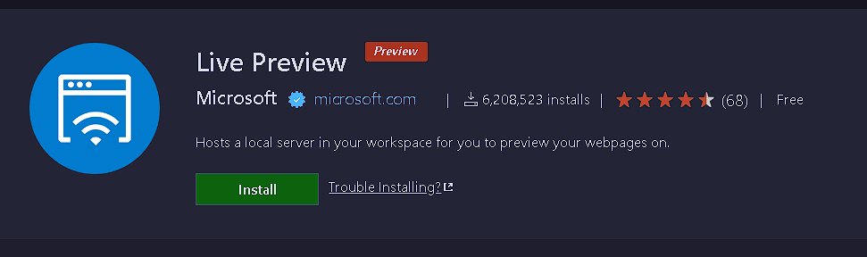
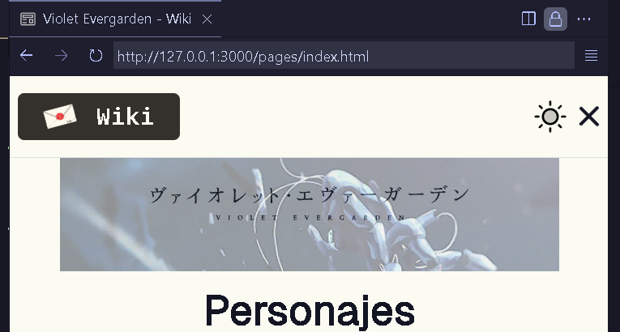

<h1 align='center'>🪀 Usando un servidor</h1>

Con el despliegue en _GitHub Pages_, la página prácticamente
estará en la nube, alojada en un servidor, permitiendo la
obtención de recursos y referencias con **rutas abolutas**.

#### 😩 Forma tediosa

Si la página cambia de ruta, entonces todas
las referencias deben cambiar según la
posición de la página.

```html
<!-- /pages/chapters -->
<a href="../stories/"></a>
```

#### 😎 Forma sencilla

Si la página cambia de ruta, entonces los
recursos y referencias no cambian, ya que
se utilizan rutas absolutas.

```html
<!-- /pages/chapters -->
<a href="/pages/stores/"></a>
```

### 📦 Configuración

Dado que no utilizaremos NodeJS o cualquier otro tipo
de lenguaje para crear un servidor, únicamente haremos
uso de una extensión de Visual Studio Code llamada
[Live Preview](https://marketplace.visualstudio.com/items?itemName=ms-vscode.live-server).



Con esta extensión, podremos visualizar la página
perfectamente en un servidor local, permitiendo
el uso de rutas absolutas en las páginas HTML.

